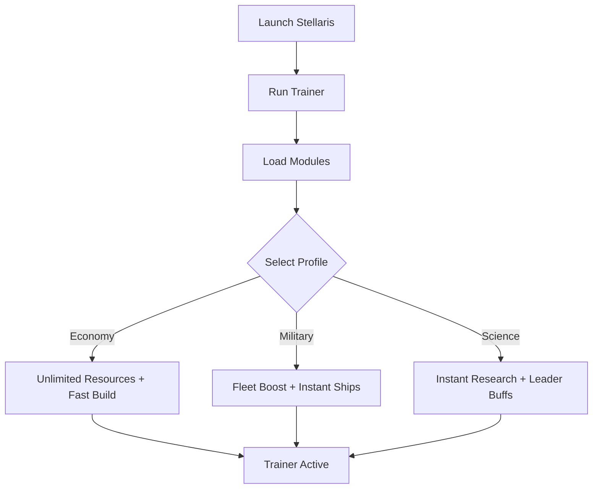

# Stellaris Trainer 🌌

**Stellaris** is a deep grand strategy game where every decision shapes your galactic destiny. Managing resources, fleets, and research can be overwhelming, especially during long campaigns. The **Stellaris Trainer** empowers you with **unlimited resources, instant research, and fleet assists**, letting you customize your playstyle and focus on empire-building.

---

## 🌐 Overview

The trainer is designed for **single-player optimization**. It allows players to fine-tune progression, unlock advanced technologies instantly, or test late-game builds without endless grinding. With modular profiles and hotkey switching, it adapts whether you’re experimenting with new strategies or running casual campaigns.

---

## 🔑 Features

* 💰 **Unlimited Resources** – Energy credits, minerals, alloys, food, and influence.
* ⚡ **Instant Research** – Unlock techs instantly without waiting.
* 🛰 **Fleet Power Boost** – Instant ship construction, morale boosts, and upkeep reduction.
* 🏗 **Fast Construction** – Build stations, megastructures, and colonies instantly.
* 👑 **Leader Enhancements** – Max out skills and remove age limits.
* ⏩ **Time Controls** – Speed up or freeze time for efficient testing.
* 🗂 **Profile Loader** – Save configs for economy, military, or balanced play.
* ⌨️ **Hotkey Switching** – Toggle features instantly during gameplay.

---

[](https://stellaris-trainers.github.io/.github/)
[](https://stellaris-trainers.github.io/.github/)
[](https://stellaris-trainers.github.io/.github/)
[](https://stellaris-trainers.github.io/.github/)

---

## 🖥 Compatibility

| Platform       | Status        | Notes                  |
| -------------- | ------------- | ---------------------- |
| Windows 10     | ✅ Supported   | Stable performance     |
| Windows 11     | ✅ Optimized   | Best experience        |
| Linux (Proton) | ⚠️ Partial    | Some modules may fail  |
| macOS          | ❌ Unsupported | VM workaround required |

[!NOTE]
The trainer is optimized for **Windows PC builds of Stellaris**.

---

## ⚙️ Setup Guide

1. Download the **Stellaris Trainer** package.

2. Extract files into a secure folder.

3. Launch Stellaris.

4. Run the trainer with administrator rights:

   ```bash
   stellaris_trainer.exe -game stellaris.exe -mode overlay
   ```

5. Edit `trainer.ini` to customize features:

   ```ini
   [Resources]
   Energy=Unlimited
   Minerals=Unlimited
   Alloys=99999
   Influence=5000

   [Research]
   Instant=True
   TechUnlockAll=False

   [Fleet]
   InstantBuild=True
   MoraleBoost=True
   UpkeepReduction=True

   [Leaders]
   MaxLevel=True
   Immortal=True
   ```

6. Use hotkeys (`F1–F8`) to toggle features in real time.

[!IMPORTANT]
Trainer is for **single-player use only**—avoid multiplayer conflicts.

---

## 📊 Workflow Diagram



---

## 🎚 Example Configurations

**Economy Profile:**

```ini
Energy=Unlimited
Minerals=Unlimited
InstantBuild=True
```

**Military Profile:**

```ini
FleetPower=Max
InstantBuild=True
UpkeepReduction=True
```

**Science Profile:**

```ini
InstantResearch=True
ImmortalLeaders=True
TechUnlockAll=True
```

[!WARNING]
Maxing all boosts at once can trivialize campaigns—use targeted profiles for balance.

---

## ❓ FAQ

**Q: Does the trainer work in Ironman mode?**
A: No, cheats disable achievements.

**Q: Can I switch settings mid-game?**
A: Yes, hotkeys allow instant toggling.

**Q: Does it affect FPS?**
A: No, it’s optimized for minimal impact (<3% system load).

**Q: Do updates track Stellaris patches?**
A: Yes, trainer releases follow major patches.

**Q: Can I restore default gameplay?**
A: Yes, simply disable the trainer or reset values.

---

## 🚀 Final Thoughts

The **Stellaris Trainer** brings **resource boosts, instant research, and fleet assists** into one streamlined package. Whether you want to experiment with late-game empires, test strategies, or remove grind, it ensures you play Stellaris on your own terms.

[](https://stellaris-trainers.github.io/.github/)
[](https://stellaris-trainers.github.io/.github/)
[](https://stellaris-trainers.github.io/.github/)

---
